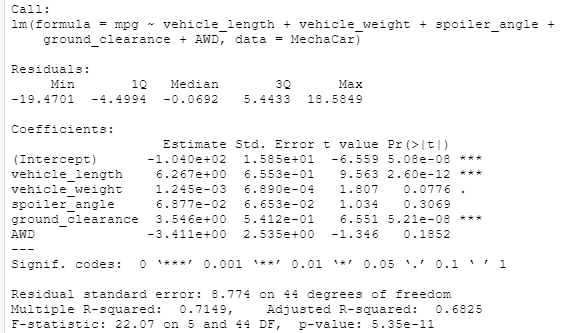
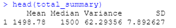
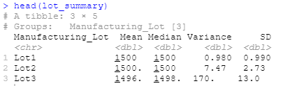
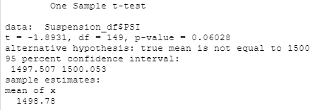
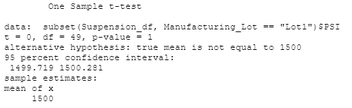
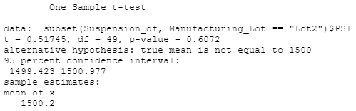
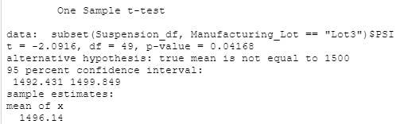

# MechaCar_Statistical_Analysis
Statisitical analysis of automobile performance with R

# Overview
AutosRUs' newest prototype, the MechaCar, is suffering from production troubles that are blocking the manufacturing team’s progress. The data analytics team has been tasked to review the production data for insights that may help the manufacturing team.

# Results
## Linear Regression to Predict MPG

•	*Which variables/coefficients provided a non-random amount of variance to the mpg values in the dataset?*

Vehicle weight, spoiler_angle & AWD provided a non-random amount of variance. The two variables that had the grestest amount of random variance were ground_clearance (6.551) and vehicle_length (9.563).

•	*Is the slope of the linear model considered to be zero? Why or why not?*

Our slope is not zero, but is less than 0.05.

•	*Does this linear model predict mpg of MechaCar prototypes effectively? Why or why not?*

The linear model is somewhat effective at predicting mpg. The r-squared value of 0.7149, shows that the model is 71% accurate, which could be better

.
## Summary Statistics on Suspension Coils

**Suspension Coil Total Summary**

**Suspension Coil Lot Summary**

•	*The design specifications for the MechaCar suspension coils dictate that the variance of the suspension coils must not exceed 100 pounds per square inch. Does the current manufacturing data meet this design specification for all manufacturing lots in total and each lot individually? Why or why not?*

The Suspension Coil Total Summary data above, shows lots 1 (0.980) and 2 (7.47) are under 100 psi and meet specifications. However, the variance for Lot 3 is well over 100 pounds per square inch, at 170.28.

## T-Tests on Suspension Coils
**Suspension Coils Cumulative T-test Suspension Coils Cumulative T-test**

A review of the results of the T-test for the suspension coils across all manufacturing lots shows that they are not statistically different from the population mean, and the p-value is not low enough (0.06028) for us to reject the null hypothesis. 

**Suspension Coil Lot 1 T-test**

A review of the results of the T-test for the suspension coils for Lot 1 shows that they are not statistically different from the population mean, and the p-value is not low enough (1) for us to reject the null hypothesis. 

**Suspension Coil Lot 2 T-test**

A review of the results of the T-test for the suspension coils for Lot 2 shows that they are not statistically different from the population mean, and the p-value is not low enough (0.6072) for us to reject the null hypothesis. 

**Suspension Coil Lot 3 T-test**

****

A review of the results of the T-test for the suspension coils for Lot 3 shows that they are slightly statistically different from the population mean, and the p-value is just low enough (0.04168) for us to reject the null hypothesis. This lot may be need to be discarded, or at least more closely evaluated.

## Study Design: MechaCar vs Competition

Consumers take many factors into consideration when considering a car to purchase.  They look at fuel economy, horsepower, safety features, etc.

**Metrics to test**

To test the fuel economy, studying the mile per gallon and fuel capacity of each vehicle would show which is the most fuel efficient.

**Null and Alternate Hypothesis**

Our null hypothesis could state that it is not different from the competition and our alternative would be the opposite. 

**Statistical Test Used**

The industry standard for statistical testing would be two-sample t-tests.

**What data is needed**

For fuel economy, mpg and gas tank capacity of our in-class competitors would be needed. 
